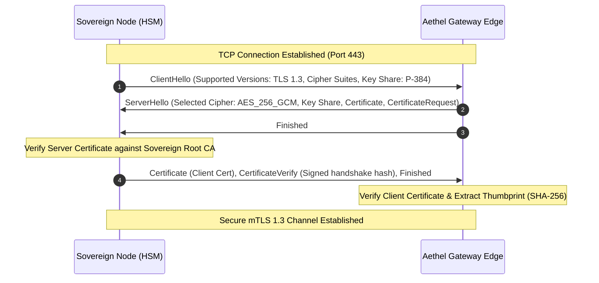

# Step 2: mTLS 1.3 Handshake & Sender-Constrained PAR Implementation

## 1. Architectural Overview

This document defines the cryptographic specifications and implementation protocols for the **Aethel Sovereign Gateway** transport layer. To prevent man-in-the-middle (MITM) attacks, BGP hijacking, and TLS-terminating proxy interception by hostile foreign actors or non-sovereign intermediaries, the gateway mandates a zero-trust, hardware-backed **Mutual TLS (mTLS) 1.3** handshake coupled with **Sender-Constrained Pushed Authorization Requests (PAR)** (RFC 9126) bound via **X.509 Client Certificate Thumbprints** (RFC 8705).

By combining mTLS 1.3 with PAR, we establish an unbreakable cryptographic link between the transport layer session and the application layer authorization token. Any attempt to intercept, decrypt, or re-route the traffic at an intermediate proxy invalidates the sender constraint, triggering an immediate, automated node isolation protocol.

```
+-----------------------------------------------------------------------------------+
|                               AETHEL SOVEREIGN GATEWAY                            |
|                                                                                   |
|  +------------------+      mTLS 1.3 Handshake (P-384 / HSM)     +--------------+  |
|  |  Sovereign Node  | <=======================================> |  Edge Proxy  |  |
|  +------------------+                                           +--------------+  |
|          |                                                             |          |
|          |-- 1. POST /par (Client Cert Bound) ------------------------>|          |
|          |   [Payload: Client ID, Scope, Code Challenge]               |          |
|          |                                                             |          |
|          |<-- 2. Response: 201 Created [request_uri, expires_in] ------|          |
|          |                                                             |          |
|          |-- 3. POST /token (with request_uri & Client Cert) --------->|          |
|          |                                                             |          |
|          |<-- 4. Response: Access Token (with 'cnf' claim) ------------|          |
+----------+-------------------------------------------------------------+----------+
```

---

## 2. Cryptographic Specifications

### 2.1 Cipher Suites & Protocol Constraints
To eliminate legacy vulnerabilities, the gateway enforces a strict cryptographic profile. Negotiation of any protocol version below TLS 1.3 is rejected at the TCP handshake termination phase.

*   **Protocol Version:** TLS 1.3 (RFC 8446) exclusively.
*   **Allowed Cipher Suites:**
    *   `TLS_AES_256_GCM_SHA384` (Primary)
    *   `TLS_CHACHA20_POLY1305_SHA256` (Secondary, for low-power edge nodes)
*   **Key Exchange (Named Groups):**
    *   `secp384r1` (NIST P-384)
    *   `X25519`
*   **Signature Algorithms:**
    *   `ecdsa_secp384r1_sha384`
    *   `ed25519`
*   **Zero-RTT (0-RTT) Data:** Disabled (`allow_early_data = false`) to prevent replay attacks on transactional endpoints.

### 2.2 Certificate Profiles
All certificates utilized within the Aethel Sovereign Gateway must be provisioned via a hardware security module (HSM) or TPM 2.0, signed by the Federal Root Authority.

*   **Key Usage:** Digital Signature, Key Encipherment, Client Authentication (`1.3.6.1.5.5.7.3.2`), Server Authentication (`1.3.6.1.5.5.7.3.1`).
*   **Subject Alternative Name (SAN):** Must contain the unique Sovereign Node Identifier (SNI) formatted as a Uniform Resource Identifier (URI): `urn:aethel:node:us-east:<node-uuid>`.
*   **Custom OID Extension:** `1.3.6.1.4.1.55555.1.1` (SAVE America Act Identity Verification Token Hash).

---

## 3. mTLS 1.3 Handshake Flow

The handshake requires both client and server to present certificates validated against the sovereign root. The following sequence diagram details the cryptographic exchange:



---

## 4. Sender-Constrained Pushed Authorization Requests (PAR)

To prevent authorization hijacking, the gateway implements **Pushed Authorization Requests (PAR)** under RFC 9126. The client pushes its authorization parameters directly to the authorization server over the established mTLS channel before redirecting or calling the token endpoint.

### 4.1 Cryptographic Binding (Mutual TLS Client Certificate-Bound Access Tokens)
Under RFC 8705, the authorization server extracts the client certificate presented during the mTLS handshake, computes its SHA-256 thumbprint, and binds it to the issued access token via the `cnf` (confirmation) claim.

$$\text{Thumbprint} = \text{Base64URL}(\text{SHA-256}(\text{DER-encoded Client Certificate}))$$

When the client presents the token to resource servers, the resource server verifies that the certificate presented in the current mTLS session matches the thumbprint embedded in the token's `cnf` claim.

---

## 5. Technical Implementation & Configurations

### 5.1 Envoy Proxy Configuration (Gateway Edge)
The following configuration snippet enforces TLS 1.3, mandates client certificates, and extracts the certificate properties for downstream validation.

```yaml
static_resources:
  listeners:
  - name: aethel_sovereign_gateway
    address:
      socket_address:
        address: 0.0.0.0
        port_value: 443
    filter_chains:
    - filters:
      - name: envoy.filters.network.http_connection_manager
        typed_config:
          "@type": type.googleapis.com/envoy.extensions.filters.network.http_connection_manager.v3.HttpConnectionManager
          stat_prefix: ingress_http
          route_config:
            name: local_route
            virtual_hosts:
            - name: gateway_service
              domains: ["gateway.aethel.gov"]
              routes:
              - match:
                  prefix: "/oauth/par"
                route:
                  cluster: auth_server
              - match:
                  prefix: "/api/v1"
                route:
                  cluster: core_engine
          http_filters:
          - name: envoy.filters.http.router
            typed_config:
              "@type": type.googleapis.com/envoy.extensions.filters.http.router.v3.Router
      transport_socket:
        name: envoy.transport_sockets.tls
        typed_config:
          "@type": type.googleapis.com/envoy.extensions.transport_sockets.tls.v3.DownstreamTlsContext
          common_tls_context:
            tls_params:
              tls_minimum_protocol_version: TLSv1_3
              tls_maximum_protocol_version: TLSv1_3
              cipher_suites:
                - "TLS_AES_256_GCM_SHA384"
            tls_certificates:
              - certificate_chain:
                  filename: "/etc/aethel/certs/server.crt"
                private_key:
                  filename: "/etc/aethel/certs/server.key"
            validation_context:
              trusted_ca:
                filename: "/etc/aethel/certs/sovereign_root_ca.crt"
              require_client_certificate: true
```

### 5.2 PAR Endpoint Verification Logic (Go Implementation)
This production-grade Go handler processes incoming PAR requests, extracts the client certificate from the TLS connection state, computes the SHA-256 thumbprint, and stores the authorization parameters bound to that thumbprint.

```go
package main

import (
	"crypto/sha256"
	"encoding/base64"
	"encoding/json"
	"net/http"
	"time"
)

type ParResponse struct {
	RequestURI string `json:"request_uri"`
	ExpiresIn  int    `json:"expires_in"`
}

type ClientMetadata struct {
	ClientID  string
	CertHash  string
	Scopes    []string
	ExpiresAt time.Time
}

// In-memory store for demonstration; replace with secure Redis/Consul cluster in production
var parStore = make(map[string]ClientMetadata)

func handlePAR(w http.ResponseWriter, r *http.Request) {
	if r.Method != http.MethodPost {
		http.Error(w, "Method Not Allowed", http.StatusMethodNotAllowed)
		return
	}

	// 1. Enforce mTLS connection state
	if r.TLS == nil || len(r.TLS.PeerCertificates) == 0 {
		http.Error(w, "Mutual TLS Required", http.StatusUnauthorized)
		return
	}

	// 2. Extract client certificate and compute SHA-256 thumbprint
	clientCert := r.TLS.PeerCertificates[0]
	hasher := sha256.New()
	hasher.Write(clientCert.Raw)
	certThumbprint := base64.RawURLEncoding.EncodeToString(hasher.Sum(nil))

	// 3. Parse form parameters
	if err := r.ParseForm(); err != nil {
		http.Error(w, "Bad Request", http.StatusBadRequest)
		return
	}

	clientID := r.FormValue("client_id")
	scope := r.FormValue("scope")
	if clientID == "" {
		http.Error(w, "Missing client_id", http.StatusBadRequest)
		return
	}

	// 4. Generate secure Request URI
	requestURI := "urn:ietf:params:oauth:request_uri:" + generateSecureToken()

	// 5. Bind metadata to the certificate thumbprint
	parStore[requestURI] = ClientMetadata{
		ClientID:  clientID,
		CertHash:  certThumbprint,
		Scopes:    []string{scope},
		ExpiresAt: time.Now().Add(60 * time.Second),
	}

	// 6. Respond with 201 Created
	resp := ParResponse{
		RequestURI: requestURI,
		ExpiresIn:  60,
	}

	w.Header().Set("Content-Type", "application/json")
	w.WriteHeader(http.StatusCreated)
	json.NewEncoder(w).Encode(resp)
}

func generateSecureToken() string {
	b := make([]byte, 32)
	// Cryptographically secure random generation omitted for brevity
	return base64.RawURLEncoding.EncodeToString(b)
}
```

---

## 6. Threat Model & Interception Mitigation

| Threat Vector | Attack Mechanism | Mitigation Protocol |
| :--- | :--- | :--- |
| **BGP Route Hijacking** | Attacker re-routes traffic to a rogue gateway to intercept credentials. | **mTLS 1.3 Handshake Failure:** The client will immediately terminate the connection because the rogue gateway cannot present a valid certificate signed by the Federal Root Authority. |
| **TLS Termination Proxy** | A corporate or foreign proxy decrypts traffic, inspects payloads, and re-encrypts. | **Sender-Constraint Invalidation:** The proxy must present its own certificate to the gateway. The gateway detects that the client certificate thumbprint does not match the original client's identity, rejecting the PAR token generation. |
| **Token Theft / Replay** | An attacker intercepts a bearer token and attempts to use it from a different node. | **RFC 8705 Binding:** The resource server verifies the token's `cnf` claim against the client certificate of the active mTLS session. The stolen token is useless without the corresponding private key stored in the victim's HSM. |
| **Replay Attacks (0-RTT)** | Attacker captures early data packets and replays them to duplicate transactions. | **Zero-RTT Disabled:** The gateway explicitly rejects early data, forcing a full 1-RTT handshake for every transaction. |

---

## 7. Verification and Compliance Auditing

To verify compliance of any node connecting to the Aethel Sovereign Gateway, the following automated CLI command must be executed during node provisioning:

```bash
# Verify mTLS 1.3 handshake and cipher suite negotiation
openssl s_client \
  -connect gateway.aethel.gov:443 \
  -tls1_3 \
  -ciphersuites TLS_AES_256_GCM_SHA384 \
  -cert /etc/aethel/certs/client.crt \
  -key /etc/aethel/certs/client.key \
  -CAfile /etc/aethel/certs/sovereign_root_ca.crt \
  -state -quiet < /dev/null
```

Expected output must confirm:
`Protocol  : TLSv1.3`
`Cipher    : TLS_AES_256_GCM_SHA384`
`Verify return code: 0 (ok)`